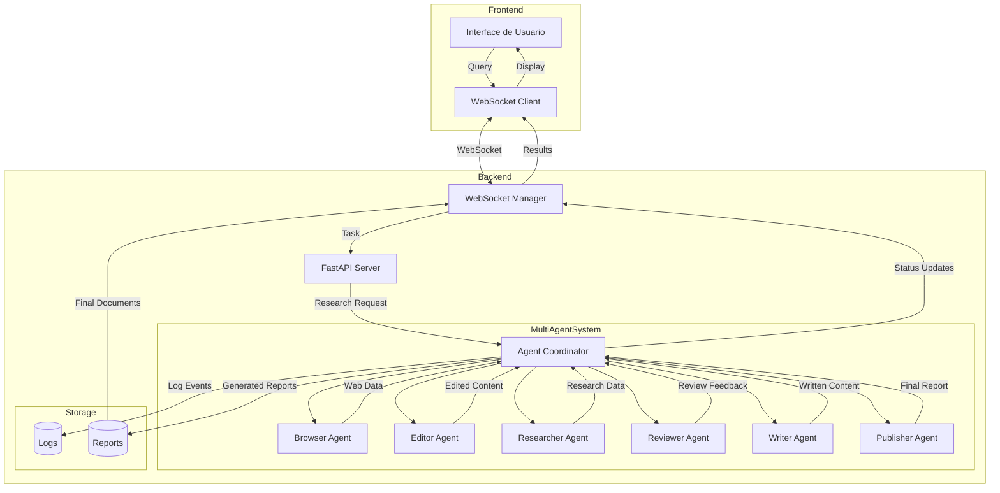

# GPT Researcher - Diseño de la Aplicación

## Estructura General

La aplicación sigue una arquitectura cliente-servidor con WebSocket para comunicación en tiempo real.

### 1. Frontend

El sistema multi-agente proporciona:
- Coordinación de múltiples agentes especializados
- Investigación y recopilación de información
- Generación y edición de reportes
- Revisión y mejora de contenido

### 2. Inicialización del Sistema

1. **Configuración Inicial**
   - Carga de variables de entorno (.env)
   - Creación del directorio de logs
   - Configuración del sistema de logging
   - Supresión de logs verbosos (fontTools)

2. **Servidor FastAPI**
   - Inicialización del servidor en puerto 8000
   - Configuración de CORS y middleware
   - Establecimiento de rutas y endpoints

### 3. Sistema Multi-Agente

El sistema incluye varios agentes especializados:
- Browser Agent: Navegación y búsqueda web
- Editor Agent: Edición y formato de contenido
- Researcher Agent: Investigación profunda
- Reviewer Agent: Revisión de calidad
- Revisor Agent: Mejoras y correcciones
- Writer Agent: Generación de contenido
- Publisher Agent: Formateo final y publicación

### 4. Flujo de Datos

1. **Inicio de Petición**
   - Usuario ingresa consulta en frontend
   - Se establece conexión WebSocket
   - Se envían parámetros de investigación

2. **Procesamiento Backend**
   - `main.py` recibe y valida la petición
   - `websocket_manager.py` establece streaming
   - `server_utils.py` coordina el proceso

3. **Investigación Multi-Agente**
   - Sistema multi-agente se activa
   - Agentes realizan investigación coordinada
   - Cada agente ejecuta su tarea especializada
   - Se mantiene registro detallado en logs
   - Se genera reporte según especificaciones

4. **Respuesta y Archivos**
   - Reporte se envía al frontend
   - Se generan archivos en múltiples formatos:
     - PDF
     - DOCX
     - Markdown
     - JSON (logs)
   - Usuario recibe resultados y puede descargarlos

### 5. Sistema de Logging

El sistema implementa logging comprehensivo:
- Logs detallados en `logs/app.log`
- Formato timestamp - nombre - nivel - mensaje
- Handlers para archivo y consola
- Supresión de logs innecesarios
- Tracking de investigaciones y errores

### 6. Gestión de WebSocket

El WebSocketManager proporciona:
- Conexiones en tiempo real
- Colas de mensajes asíncronas
- Gestión de tareas de envío
- Chat con agentes basado en memoria
- Streaming de resultados de investigación

### 7. Tipos de Reportes

Se soportan múltiples tipos:
- Reporte Básico (BasicReport)
- Reporte Detallado (DetailedReport)
- Reporte Multi-Agente (investigación colaborativa)

### 8. Extensibilidad

El sistema está diseñado para:
- Agregar nuevos tipos de agentes
- Implementar nuevos formatos de reporte
- Integrar fuentes adicionales de datos
- Personalizar flujos de investigación

## Notas de Implementación

- TypeScript para frontend
- FastAPI para backend
- WebSocket para comunicación en tiempo real
- Sistema modular de agentes
- Logging comprehensivo
- Manejo asíncrono de tareas

